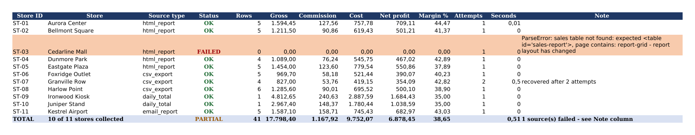

# Resilient Sales Collector

> **What this is:** a self-contained demo I built to show how I structure a multi-source
> daily collection job. It runs entirely offline against local fixture files. It was not
> built for or delivered to any client, and the stores, numbers and sources are invented.

## 1. The problem

A retail group collects each day's sales from eleven stores, and every store reports
differently: a shared web platform, back-office CSV exports, a terminal that only gives a
daily total, a manager who emails the numbers in. All of it has to land in one Excel file
with commission, cost and net profit applied. The hard requirement is not the spreadsheet —
it is that **when one source breaks or changes, the other ten still process, and somebody is
told exactly what broke**.

## 2. How to run it

```bash
pip install -r requirements.txt
python -m collector.run --config stores.yaml
python -m pytest
```

(Or `make demo` / `./run_demo.sh`.) No credentials, no network, no setup — every source is a
file in `fixtures/`. Output lands in `output/`.

## 3. What the demo shows

Eleven stores, four source formats, one command. **Store ST-03 fails on purpose**: its page
on the shared platform was "redesigned", so the table it expects is gone. The run keeps
going, the other ten stores are collected, the workbook is written, and the failure is
reported by store, error type and reason. Store ST-07 drops its first connection and is
recovered by the retry policy.

Real output of that run, pasted verbatim:

```text
17:29:22  INFO    Starting collection for 11 store(s)
17:29:22  INFO    ST-01 Aurora Center: parsed 5 row(s) via html_report
17:29:22  INFO    [ST-01] Aurora Center: OK (5 rows)
17:29:22  INFO    ST-02 Bellmont Square: parsed 5 row(s) via html_report
17:29:22  INFO    [ST-02] Bellmont Square: OK (5 rows)
17:29:22  ERROR   [ST-03] Cedarline Mall: ParseError: sales table not found: expected <table id='sales-report'>, page contains: report-grid - report layout has changed
17:29:22  INFO    ST-04 Dunmore Park: parsed 4 row(s) via html_report
17:29:22  INFO    [ST-04] Dunmore Park: OK (4 rows)
17:29:22  INFO    ST-05 Eastgate Plaza: parsed 5 row(s) via html_report
17:29:22  INFO    [ST-05] Eastgate Plaza: OK (5 rows)
17:29:22  INFO    ST-06 Foxridge Outlet: parsed 5 row(s) via csv_export
17:29:22  INFO    [ST-06] Foxridge Outlet: OK (5 rows)
17:29:22  WARNING ST-07 Granville Row: fetch attempt 1/3 failed (FetchError: simulated transient network error (attempt 1 of 1 staged)) - retrying in 0.5s
17:29:23  INFO    ST-07 Granville Row: fetch succeeded on attempt 2/3
17:29:23  INFO    ST-07 Granville Row: parsed 4 row(s) via csv_export
17:29:23  INFO    [ST-07] Granville Row: OK (4 rows)
17:29:23  INFO    ST-08 Harlow Point: parsed 6 row(s) via csv_export
17:29:23  INFO    [ST-08] Harlow Point: OK (6 rows)
17:29:23  INFO    ST-09 Ironwood Kiosk: parsed 1 row(s) via daily_total
17:29:23  INFO    [ST-09] Ironwood Kiosk: OK (1 rows)
17:29:23  INFO    ST-10 Juniper Stand: parsed 1 row(s) via daily_total
17:29:23  INFO    [ST-10] Juniper Stand: OK (1 rows)
17:29:23  INFO    ST-11 Kestrel Airport: parsed 5 row(s) via email_report
17:29:23  INFO    [ST-11] Kestrel Airport: OK (5 rows)

========================================================================
DAILY SALES COLLECTION - RUN REPORT
Finished at : 2026-09-11 17:29:23
Runtime     : 0.57s
Stores      : 10 of 11 collected successfully
Workbook    : output/daily_sales_consolidated.xlsx
========================================================================

FAILED SOURCES (1) - these stores are NOT in today's totals:
  [ST-03] Cedarline Mall (html_report)
      ParseError: sales table not found: expected <table id='sales-report'>, page contains: report-grid - report layout has changed
      fetch attempts used: 1

RECOVERED AFTER RETRY (worth watching):
  [ST-07] Granville Row - succeeded on attempt 2

COLLECTED:
  [ST-01] Aurora Center            5 row(s)   0.01s  via html_report
  [ST-02] Bellmont Square          5 row(s)   0.00s  via html_report
  [ST-04] Dunmore Park             4 row(s)   0.00s  via html_report
  [ST-05] Eastgate Plaza           5 row(s)   0.00s  via html_report
  [ST-06] Foxridge Outlet          5 row(s)   0.00s  via csv_export
  [ST-07] Granville Row            4 row(s)   0.50s  via csv_export
  [ST-08] Harlow Point             6 row(s)   0.00s  via csv_export
  [ST-09] Ironwood Kiosk           1 row(s)   0.00s  via daily_total
  [ST-10] Juniper Stand            1 row(s)   0.00s  via daily_total
  [ST-11] Kestrel Airport          5 row(s)   0.00s  via email_report

========================================================================
```

The resulting Summary sheet — note row ST-03 in red, and the totals that still add up:



## 4. Design decisions, and why

**One collector interface, `fetch()` then `parse()`.** `fetch()` is the only part that
touches the outside world, so it is the only part that gets retried; `parse()` is pure, so
every source can be tested against a saved payload with no network — which is exactly how
this demo and its tests run. Swapping a fixture read for an HTTP request changes one method.

**One collector per *format*, not per store.** Five of the eleven demo stores share
`html_report`. The platform is the unit of work; the store is a config entry.

**Config over code.** `stores.yaml` holds every store: id, name, collector type, source,
commission rate and cost rules, plus per-source quirks (a CSV with semicolons, comma
decimals and its own column names is handled there, not in Python). **Adding the twelfth
store is a config entry, never a code change.**

**Isolation is per source.** The runner collects each store inside its own boundary and
always produces a result — success or failure, never an exception that escapes. Unknown
errors from third-party parsers are caught too: an unanticipated bug costs one store, not
the run.

**Retry only what is worth retrying.** Exponential backoff on fetch (attempts and delay
configurable, every attempt logged). Parse errors are *not* retried — a changed layout fails
identically three times and the noise hides the cause. The attempt count is reported, so a
store that keeps needing three tries is visible before it becomes an outage.

**A summary sheet with a status column.** This is the part that matters to the person
opening the file. A store missing from the workbook looks exactly like a store that sold
nothing; a failed store therefore keeps its row, zeroed, flagged FAILED in red, with the
reason in the Note column, and the total line says `10 of 11 stores collected`. The failure
is visible in the deliverable, not just in a log nobody reads.

**Sources with no line items stay honest.** The terminal that reports only a daily figure
produces one row marked `daily total` rather than invented line items. Totals stay correct
and the detail sheet shows where detail genuinely does not exist.

## 5. What I would add for production

- **Scheduling:** cron or systemd timer, with `--fail-on-error` (already supported) so a
  monitoring system can alert on a partial run.
- **Credentials:** environment variables or a secrets manager, never in `stores.yaml`; the
  two stores that need a login get a session step inside their collector's `fetch()`.
- **Change detection:** hash each source's structure per run and warn when it shifts, so a
  layout change is caught the day it happens rather than the day the numbers look wrong.
- **Alerting:** the run report to email or WhatsApp when any store fails — the client should
  not have to open the file to learn something broke.
- **History:** keep each day's raw payload, so a parser fix can be replayed over past days
  instead of losing them.

## Project layout

```text
collector/             pipeline: config, retry, runner, calculations, excel, report
  collectors/          one module per source format
fixtures/              the offline sample sources (one is deliberately broken)
tests/                 pytest suite
stores.yaml            the store registry - the only file you edit to add a store
tools/                 optional: re-render sample_output.png from the workbook
```

MIT licensed.
